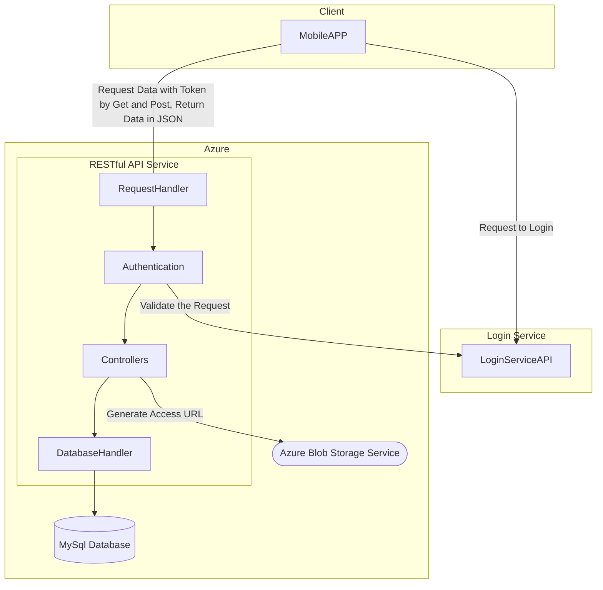
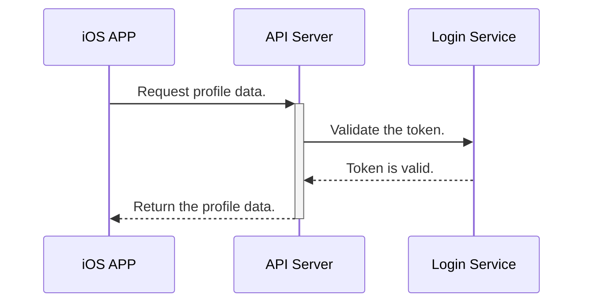
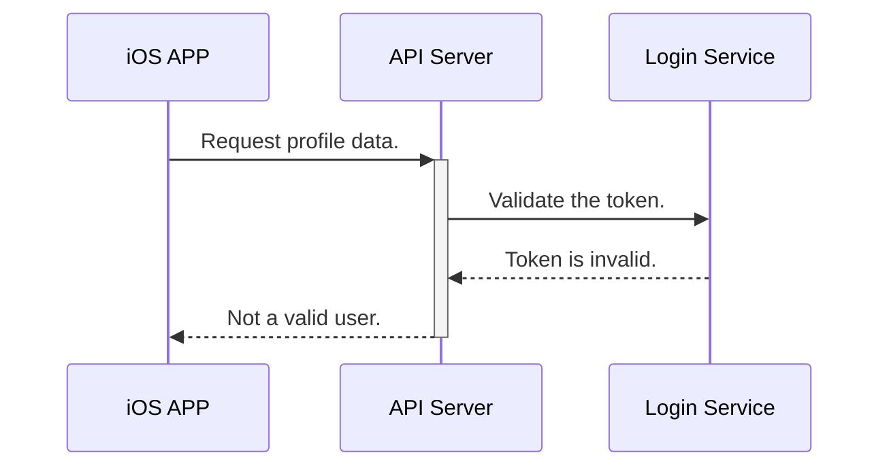

# Capstone 2020

## Introduction

This is the third iteration of the project Capstone. We are focusing on the implementation of the server side APIs as RESTful APIs. NOTE: This source code are not the actual code of the project, I have removed all business related code and just show what I have in what way.

## Getting Started

### Prepare for the development

#### Installations

- VS Code, use VS Code to write the PHP code; however, you can use something else to do that.
- PHP development environment, use [XAMPP](https://www.apachefriends.org/index.html) to set up the environment. We JUST install Apache, PHP, MySql and phpMyAdmin to the machine.
- Use [Composer](https://getcomposer.org/) to manage the project's dependencies.
- Use [Lumen](https://lumen.laravel.com/) framework to develop the APIs application.
- Use [Git](https://git-scm.com/) to make source control, you can access it from your IDE, such as VS Code.
- Use [Postman](https://www.postman.com/) to develop and test the APIs.
- Use [apiDoc](https://apidocjs.com/) to generate the API documentation.

#### Configurations

- Install extensions to VS Code: Markdown Preview Mermaid Support, Azure Repos.
- Set the [username](https://help.github.com/en/github/using-git/setting-your-username-in-git#setting-your-git-username-for-a-single-repository) and [email](https://help.github.com/en/github/setting-up-and-managing-your-github-user-account/setting-your-commit-email-address#setting-your-email-address-for-a-single-repository) for your repository in Git.
- Set the variable 'DocumentRoot' and the following one 'Directory' to the directory 'public' where in your PHP project folder that you created with Lumen in Apache configuration file 'httpd.conf'.
- Run the command `composer install --no-interaction --prefer-dist -d ./APIs` under the current project directory when you first fetch the source code to install the project's dependencies. And run the command `composer update --prefer-dist -d ./APIs` to update the dependencies when you added some new dependencies to the `composer.json` file.

#### Something Useful

- Use '#TaskId' in Git commit comment to link the task and the commit.
- Use command `git fetch` in terminal to refresh the branches from the remote server before you switch to a branch that doesn't exit in local.
- Use command `./APIs/vendor/bin/phpunit -c ./APIs/phpunit.xml` under the current project directory to run the unit tests.

### System Design

#### System Architecture Flowchart

The flowchart below shows how the system will be implement in the components.  



#### Sequence Diagram

There are two sequence diagrams of a example of a communication between the client (for example: iOS APP) and the API server below.  

Valid Token:



Invalid Token:



### APIs List

We will version the API as putting the version info as `Version` before the API endpoint, for example the current version is 'v1' and you want to access the profile API, so the API url is `https://api.exmple.com/v1/Profile`. For all API endpoints, you need to add access token into http request headers as `Authorization: JWT example-token` if the column Authentication shows `Token` in the below table.

|API|Method|Authentication|Return|Description|
| :---- | :----: | :----: | :----: | :---- |
|/{Version}/member|GET|Token|[JSON](#all-members-output-data-structure)|Get all members profile details.|
|/{Version}/member/{ID}|GET|Token|[JSON](#member-output-data-structure)|Get the specific member profile detail by given the id.|

### All Members Output Data Structure

```json
{
    "result": "SUCCESS",
    "access": "ALLOWED",
    "message": "message",
    "error": "error",
    "members": [{
        "Id": 1,
        "Title": "Title",
        "FirstNames": "FirstNames",
        "MiddleNames": "MiddleNames",
        "LastNames": "LastNames",
        "KnownAs": "KnownAs",
        "MailName": "MailName",
        "DOB": "01/10/1949",
        "PhotoFileName": "PhotoFileName",
        "Address": {
            "Id": 1,
            "Active": true,
            "StartDate": "StartDate",
            "EndDate": "EndDate",
            "Building": "Building",
            "Street": "Street",
            "TownCity": "TownCity",
            "PostCode": "PostCode",
            "Country": "Country"
        },
        "History": [{
            "Id": 1,
            "Member_ID": 2,
            "Group_ID": 3,
            "Member_End_Reason_ID": 4,
            "StartDate": "10/06/2020",
            "EndDate": "15/06/2020",
            "Capitation": "Capitation",
            "Notes": "Notes",
            "EndReason": {
                "Id": 1,
                "Name": "Name",
                "Description": "Description"
            }
        }]
    }]
}
```

### Member Output Data Structure

```json
{
    "result": "SUCCESS",
    "access": "ALLOWED",
    "message": "message",
    "error": "error",
    "member": {
        "Id": 1,
        "Title": "Title",
        "FirstNames": "FirstNames",
        "MiddleNames": "MiddleNames",
        "LastNames": "LastNames",
        "KnownAs": "KnownAs",
        "MailName": "MailName",
        "DOB": "01/10/1949",
        "PhotoFileName": "PhotoFileName",
        "Address": {
            "Id": 1,
            "Active": true,
            "StartDate": "StartDate",
            "EndDate": "EndDate",
            "Building": "Building",
            "Street": "Street",
            "TownCity": "TownCity",
            "PostCode": "PostCode",
            "Country": "Country"
        },
        "History": [{
            "Id": 1,
            "Member_ID": 2,
            "Group_ID": 3,
            "Member_End_Reason_ID": 4,
            "StartDate": "10/06/2020",
            "EndDate": "15/06/2020",
            "Capitation": "Capitation",
            "Notes": "Notes",
            "EndReason": {
                "Id": 1,
                "Name": "Name",
                "Description": "Description"
            }
        }]
    }
}
```
